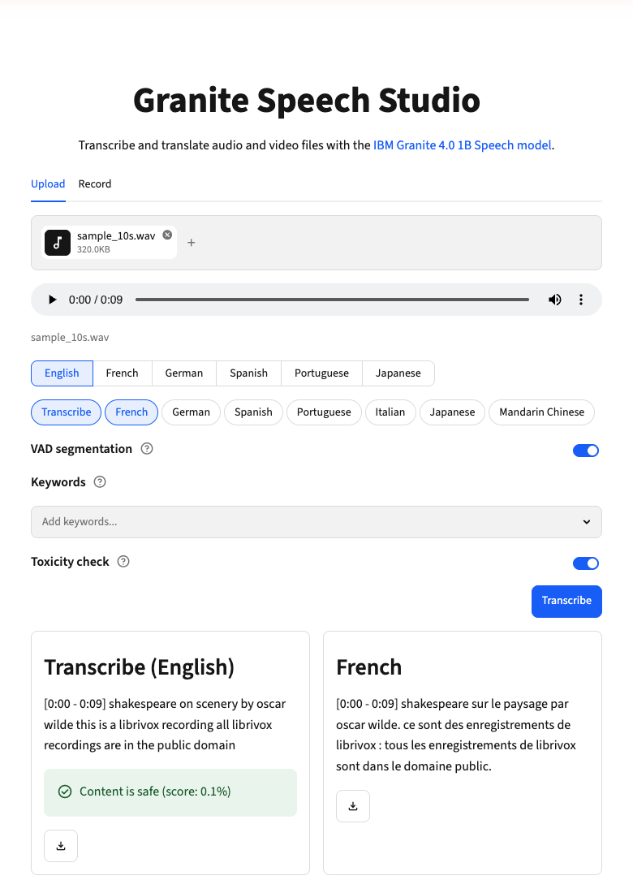
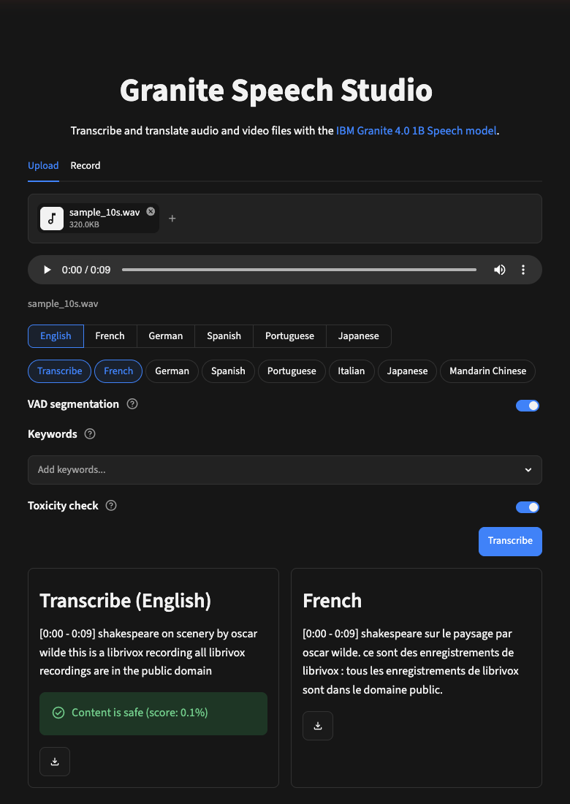

# Granite Speech Studio

[](https://github.com/darylalim/granite-speech-studio/actions/workflows/ci.yml)
[](LICENSE)
[](https://www.python.org/downloads/)

Streamlit application for transcription and translation using IBM Granite Speech on Apple Silicon with MLX.

<p align="center">
  
  
</p>
<p align="center"><em>Transcription + French translation of a sample clip, shown in the light and dark themes.</em></p>

## Features

- **Pipeline processing** — run multiple transcription and translation tasks on the same audio (Transcribe + one translation runs as a single inference per segment via chain-of-thought prompting)
- **Transcription** — English, French, German, Spanish, Portuguese, Japanese
- **Translation** — English ↔ French, German, Spanish, Portuguese, Italian, Japanese, Mandarin Chinese (Italian and Mandarin: English source only)
- **Keywords** — bias recognition toward up to 15 user-provided terms (proper nouns, acronyms, jargon)
- **VAD segmentation** — automatic speech detection with timestamped per-segment output (togglable; disable to process whole audio in one pass; auto-required for audio over 5 minutes)
- **Toxicity check** — togglable (on by default); surfaces the worst per-segment toxicity score on English output (transcription or translation to English) via Granite Guardian HAP 125m
- **Source language** — pick once; valid tasks update accordingly
- **Audio input** — upload audio (WAV, FLAC, M4A, MP3, OGG, AAC) or video (MP4, MOV, WebM, MKV — audio track is extracted) or record from microphone
- **Side-by-side results** — compare outputs in a column grid (up to 3 columns)
- **Themed UI** — cohesive IBM Carbon-inspired theme with automatic light and dark modes
- **Deferred loading** — models load on first pipeline run for instant page startup
- **Export** — download per-task transcriptions and translations as text

## How it works

Three models run as a pipeline, loaded on first run and cached thereafter:

| Model | Role | Runs on |
|-------|------|---------|
| [Granite 4.0 1B Speech (8-bit, MLX)](https://huggingface.co/mlx-community/granite-4.0-1b-speech-8bit) | Transcription and translation | Apple GPU (MLX) |
| [Silero VAD](https://github.com/snakers4/silero-vad) | Splits audio into speech segments | CPU |
| [Granite Guardian HAP 125m](https://huggingface.co/ibm-granite/granite-guardian-hap-125m) | English toxicity detection | CPU |

Audio is loaded and resampled to 16 kHz mono, optionally segmented with VAD, then transcribed and translated segment-by-segment on the GPU. English output (English-source transcription or translation into English) is scored for toxicity. Transcribe plus a single translation runs as one chain-of-thought inference per segment rather than two passes.

## Requirements

- Apple Silicon Mac (M1/M2/M3/M4)
- Python 3.12+
- [uv](https://docs.astral.sh/uv/) — Python package manager (`curl -LsSf https://astral.sh/uv/install.sh | sh`)
- [FFmpeg](https://ffmpeg.org/) — `brew install ffmpeg` (required: `torchcodec` loads FFmpeg's shared libraries at import time, so the app won't start without it)

## Setup

```bash
brew install ffmpeg   # required at runtime by torchcodec
uv sync
uv run streamlit run streamlit_app.py
```

> First run downloads the Granite Speech model (~2.9 GB) plus the VAD and guardian models, then caches them; inference runs on the Apple Silicon GPU.

## Usage

> New here? Try it with the bundled sample clip: `tests/data/audio/sample_10s.wav`.

1. Upload an audio or video file, or record from your microphone
2. Pick the source language of your audio
3. Pick tasks (transcribe, translate to a language)
4. Optionally toggle **VAD segmentation** (on by default)
5. Optionally add **Keywords** (proper nouns, acronyms, jargon)
6. Optionally toggle **Toxicity check** (on by default)
7. Click **Transcribe** to process all selected tasks
8. View side-by-side results and download as text

## Notes

- **Apple Silicon only** — inference uses MLX; there's no CUDA or CPU-only fallback.
- **Translation pivots through English** — English ↔ X only; no direct X → Y (e.g. French → German).
- **Toxicity detection is English-only** (Granite Guardian HAP).
- **Upload limit 500 MB**; with VAD off, clips are capped at 5 minutes (the model's context window).

## Development

```bash
uv run ruff check .     # lint
uv run ruff format .    # format
uv run ty check         # type-check
uv run pytest           # run tests
```

## Resources

- [Granite 4.0 1B Speech (8-bit, MLX)](https://huggingface.co/mlx-community/granite-4.0-1b-speech-8bit) — model card
- [Granite Speech collection](https://huggingface.co/collections/ibm-granite/granite-speech)
- [Technical report](https://arxiv.org/abs/2505.08699)

## Acknowledgements

- [IBM Granite](https://huggingface.co/ibm-granite) — Speech and Guardian models
- [Silero VAD](https://github.com/snakers4/silero-vad) — voice activity detection
- [Apple MLX](https://github.com/ml-explore/mlx) and [mlx-audio](https://github.com/Blaizzy/mlx-audio) — on-device inference
- [Streamlit](https://streamlit.io/) — web UI

## License

Licensed under the [Apache License 2.0](LICENSE). See [NOTICE](NOTICE) for third-party attributions.
