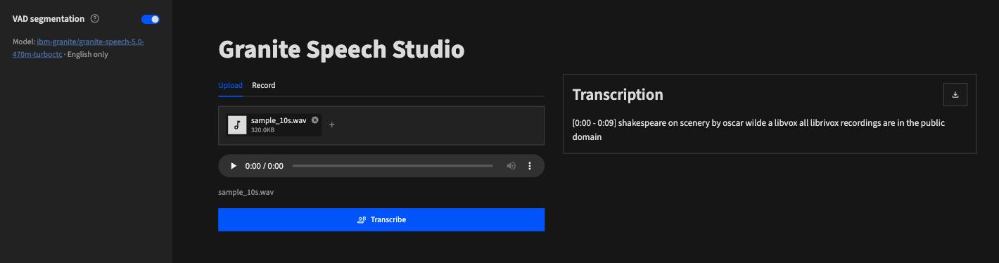

# Granite Speech Studio

[](https://github.com/darylalim/granite-speech-studio/actions/workflows/ci.yml)
[](LICENSE)
[](https://www.python.org/downloads/)

Streamlit application for English speech transcription using IBM Granite Speech 5.0 TurboCTC on Apple Silicon with MLX.

<p align="center">
  
</p>
<p align="center"><em>Timestamped transcription of the sample clip, in dark mode.</em></p>

## Features

- **Transcription** — English, with IBM Granite Speech 5.0 TurboCTC (470M, encoder-only, greedy CTC); output is lowercase and unpunctuated
- **VAD segmentation** — automatic speech detection with timestamped per-segment output, about 30 s per segment so timestamps stay readable — up to ~40 s for unbroken speech, since a forced split costs more than the overshoot (togglable; disable to process whole audio in one pass; auto-required for audio over 30 minutes)
- **Audio input** — upload audio (WAV, FLAC, M4A, MP3, OGG, AAC) or video (MP4, MOV, WebM, MKV — audio track is extracted) or record from microphone
- **Light and dark modes** — Streamlit's built-in themes; follows the system setting, switchable from the app's settings menu
- **Deferred loading** — models load on first pipeline run for instant page startup
- **Export** — download the transcription as text

## How it works

Two models run as a pipeline, loaded on first run and cached thereafter:

| Model | Role | Runs on |
|-------|------|---------|
| [Granite Speech 5.0 470M TurboCTC](https://huggingface.co/ibm-granite/granite-speech-5.0-470m-turboctc) | English transcription | Apple GPU (MLX) |
| [Silero VAD v6](https://huggingface.co/mlx-community/silero-vad-v6) | Splits audio into speech segments | Apple GPU (MLX) |

Audio is loaded and resampled to 16 kHz mono, optionally segmented with VAD, then transcribed segment-by-segment on the GPU — one encoder pass and a greedy CTC collapse per segment, with no prompt and no decoder. VAD runs on the GPU too, batching its encoder across chunks so a whole clip costs a couple of model calls rather than one per 32 ms; it falls back to the PyTorch build of the same checkpoint, on CPU, if the MLX weights are unavailable.

## Requirements

- Apple Silicon Mac (M1/M2/M3/M4)
- Python 3.12+
- [uv](https://docs.astral.sh/uv/) — Python package manager (`curl -LsSf https://astral.sh/uv/install.sh | sh`)

No system FFmpeg is needed: audio and video are decoded by [PyAV](https://pyav.org/), which bundles FFmpeg in its wheel.

## Setup

```bash
uv sync
uv run streamlit run streamlit_app.py
```

> First run downloads the Granite Speech model (~0.9 GB) plus the VAD model, then caches them; inference runs on the Apple Silicon GPU.

## Usage

> New here? Try it with the bundled sample clip: `tests/data/audio/sample_10s.wav`.

1. Upload an audio or video file, or record from your microphone
2. Optionally toggle **VAD segmentation** (on by default)
3. Click **Transcribe**
4. Read the timestamped transcript and download it as text

## Notes

- **Apple Silicon only** — inference uses MLX; there's no CUDA or CPU-only fallback.
- **English only** — Granite Speech 5.0 TurboCTC is an English ASR model; there is no translation and no other source language.
- **Output is lowercase and unpunctuated** — the model's training transcripts were normalised that way, and the app does not restore casing or punctuation.
- **Upload limit 500 MB**; with VAD off, clips are capped at 30 minutes — memory grows linearly with clip length (about 2 MB per second of audio), and a single inference over 30 minutes already peaks around 4.5 GB before counting the decoded audio held alongside it.

## Development

```bash
uv run ruff check .     # lint
uv run ruff format .    # format
uv run ty check         # type-check
uv run pytest           # run tests
```

## Resources

- [Granite Speech 5.0 470M TurboCTC](https://huggingface.co/ibm-granite/granite-speech-5.0-470m-turboctc) — IBM's model card, and the repo this app loads
- [Design of the IBM Granite 5.0 TurboCTC ASR Model](https://arxiv.org/abs/2609.20104) — the paper
- [mlx-audio `granite_speech5_ctc`](https://github.com/Blaizzy/mlx-audio/tree/main/mlx_audio/stt/models/granite_speech5_ctc) — the MLX port this app runs
- [Granite Speech collection](https://huggingface.co/collections/ibm-granite/granite-speech)

## Acknowledgements

- [IBM Granite](https://huggingface.co/ibm-granite) — Speech model
- [Silero VAD](https://github.com/snakers4/silero-vad) — voice activity detection ([MLX port](https://huggingface.co/mlx-community/silero-vad-v6))
- [Apple MLX](https://github.com/ml-explore/mlx) and [mlx-audio](https://github.com/Blaizzy/mlx-audio) — on-device inference
- [PyAV](https://pyav.org/) and [FFmpeg](https://ffmpeg.org/) — audio and video decoding
- [Streamlit](https://streamlit.io/) — web UI

## License

Licensed under the [Apache License 2.0](LICENSE). See [NOTICE](NOTICE) for third-party attributions.
